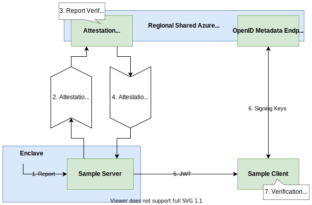

# Go remote attestation sample using Microsoft Azure Attestation
This sample shows how to do remote attestation of an EGo enclave in combination with [Microsoft Azure Attestation](https://docs.microsoft.com/en-us/azure/attestation/). It consists of a server running in an enclave and a client (the relying party) that attests the server before sending a secret. The Azure Attestation Provider simplifies the attestation process for the client.

**Note: This sample only works on SGX-FLC systems. Some error handling is omitted for brevity.**

## How it works



1. The server generates a self-signed certificate and a report for remote attestation that includes the certificate's hash. It thereby binds the certificate to the enclave's identity.

1. An Attestation Request containing the report and the gernerated certificate is sent from the server to the Azure Attestation Provider. In this example, a [Regional Shared Provider](https://docs.microsoft.com/en-us/azure/attestation/basic-concepts#regional-shared-provider) is used, but it is also possible to run one's own Attestation Provider.

1. The Azure Attestation Provider validates the Quote, which is part of the report, and ensures that the report contains the hash of the Enclave Held Data, which in this case is the self-signed certificate.

1. If the validation succeeds, the Attestation Provider generates a signed JSON Web Token (JWT) and returns the token to the server in the Attestation Response. The token contains the Encalve Held Data (the certificate) and information for the token verification.

1. The server runs HTTPS and provides the following endpoints to the client:
    * `/token` returns the JSON Web Token. The client requests the token skipping TLS certificate verification.
    * `/secret` receives the secret via a query parameter named `s`.

1. From the Attestation Provider's OpenID Metadata Endpoint, the client queries the public key which the token was signed with. In this case, we need to ensure the channel used to get the signing keys is secure by using TLS.

1. The client verifies the token's signature and the claims from the token body. If the token is valid and contains the correct report, the identity and integrity of the server is guranteed. The certificate is extracted from the report.

The client can now establish a secure TLS connection to the enclaved server using the validated certificate and send its secret.

EGo's API provides helpful functions to simplify the remote attestation with Microsoft Azure Attestation. The server can use the [CreateAzureAttestationToken()](https://pkg.go.dev/github.com/edgelesssys/ego/enclave#CreateAzureAttestationToken) function form the enclave package to conduct steps 1 - 4 and get the token. The client can use the [VerifyAzureAttestationToken()](https://pkg.go.dev/github.com/edgelesssys/ego/attestation#VerifyAzureAttestationToken) function from EGo's attestation package to perform steps 6 and 7. While this function verifies the signature and the public claims of the token, the client has to verify the resulting report values.

## Try it yourself!

The server can be built and run as follows:
```sh
ego-go build
ego sign server
ego run server
```

The client can be built using a recent Go compiler:
```sh
go build ra_client/client.go
```

The client expects the `signerID` (`MRSIGNER`) as an argument. The `signerID` can be derived from the signer's public key using `ego signerid`:
```sh
./client -s `ego signerid public.pem`
```

## Further Resources

[Microsoft Azure Attestation Documentation](https://docs.microsoft.com/en-us/azure/attestation/)

[What validation does Azure Attestation do?](https://docs.microsoft.com/en-us/azure/attestation/faq#what-validations-does-azure-attestation-perform-for-attesting-sgx-enclaves)

[Benifits of Azure Attestation](https://docs.microsoft.com/en-us/azure/attestation/overview#why-use-azure-attestation)
